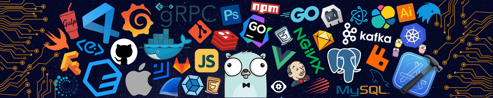

<h1 align="center" >Hi 👋, I'm Sabiq Aijaz</h1>
<table align="center" width="100%">
  <tr> 
    <td align="center" valign="middle">
    
    </td> 
    <td align="center" valign="middle">
      
    </td>
  </tr> 
</table>

  

 

<h2 align="center">🧠 What I'm Building & Exploring</h2>

<table align="center">
  <tr>
    <td>
      
    </td>
    <td>
     <ul align="center">
  <li>🔧 Architecting backend services with Go</li>
  <li>🧩 Working on full-stack apps with AI-powered features</li>
  <li>🐳 Deploying with Docker + Compose for fast local dev</li>
  <li>📱 Building smooth mobile experiences using React Native</li>
  <li>🧠 Learning system design, exploring gRPC and scalable architecture</li>
</ul>
    </td>
    <td>      

  

  </td>
  </tr>
</table>

<h2 align="center">⚒️ Languages & Tools</h2>

  

<h2 align="center">🌐 Connect With Me</h2>

  
  

