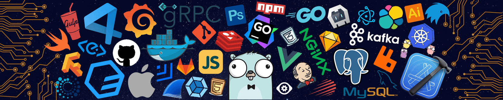

<h1 align="center">Hi 👋, I'm Sabiq Aijaz</h1>
Automation & AI Engineer based in Kashmir. I build production-grade LLM systems and agentic pipelines — not demos.
Currently working as an Automation Solutions Engineer at Brillo, designing and deploying enterprise RPA solutions with UiPath. Outside of work, I'm building toward AI engineering roles focused on LLM infrastructure, multi-agent systems, and cloud-native deployment.
 
---
## ⚡ Tech Stack
 
**AI/ML:** LangChain · LangGraph · DSPy · RAG · Ollama · FastAPI  
**Automation:** UiPath · n8n · Python  
**Cloud/DevOps:** Azure · Docker · GitHub Actions  
**Backend:** Node.js · PostgreSQL · MongoDB  
 

  

## 🌐 Connect With Me

 
[LinkedIn](https://www.linkedin.com/in/sabiq-aijaz) · [Portfolio](https://www.sabiq-aijaz.in) · [Blog](https://medium.com/@bhatsabiq9) · bhatsabiq9@gmail.com
